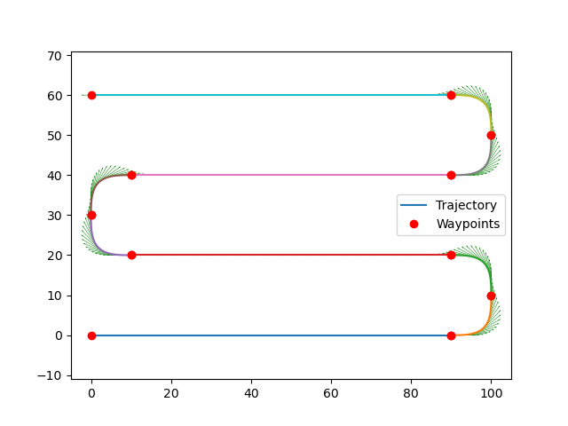
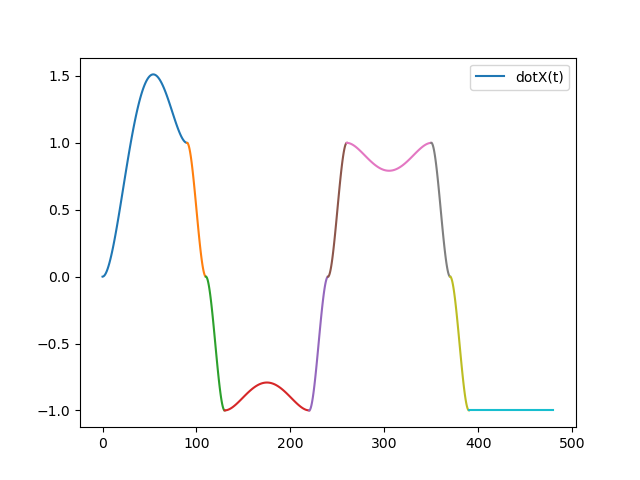
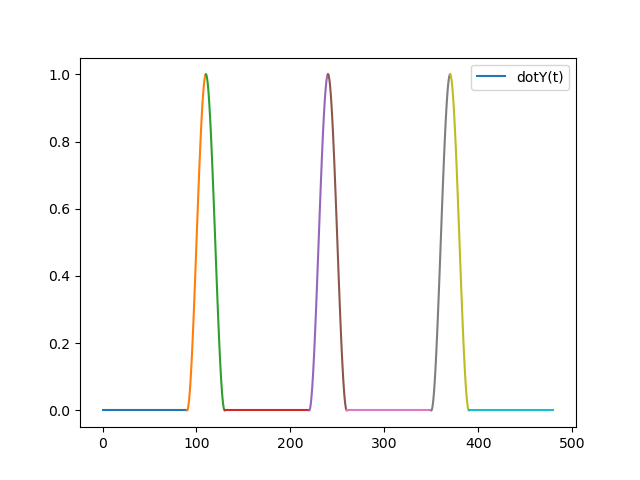

# Trajectory Creator for Autonomous Robots


## Overview
This application allows you to design and define 2D trajectories for an autonomous robot. You can specify key waypoints that the robot must pass through, as well as the desired arrival angles at each point. The tool is particularly useful for robotics applications requiring precise navigation and control, such as underwater vehicles, drones, or mobile robots.

With this tool, you can:
- Define trajectory points with corresponding arrival angles.
- Generate trajectory files for simulation or deployment.
- Visualize the trajectory and checkpoints on an interactive map.
- Export the trajectory in formats suitable for robotic navigation.

---

## Features
- **Waypoint Definition:** Easily add, edit, or remove waypoints.
- **Angle Specification:** Specify the robot's orientation (arrival angle) at each waypoint.
- **Interactive Map:** Visualize the trajectory and checkpoints dynamically.
- **Export Options:** Save trajectory data in CSV format or any other format required for integration with control systems.
- **Customizable Visuals:** Tailor the map view and waypoint colors for better visualization.

---

## Installation
1. Clone this repository:
   ```bash
   git clone <repository_url>
   cd <repository_directory>
   
2. Modify main.py according to your mission

3. launch the file:
   ```bash
   python3 main.py
4. Visualize your stored data in Mission/date/time/file.csv and view the GPS view with map.html


## Example of visualizations: 








